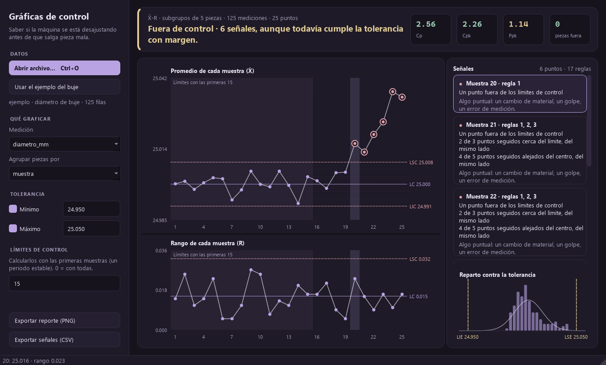

# Gráficas de control (SPC)

[](https://github.com/Brunich/graficas-de-control/actions/workflows/ci.yml)

*Saber si la máquina se está desajustando antes de que salga pieza mala.*

App de escritorio para Windows. Abres las mediciones de una pieza (CSV o Excel) y te dice si el proceso está bajo control, qué puntos avisan que algo cambió y si alcanza la tolerancia (Cp y Cpk). Todo en palabras y con qué revisar primero.



**Descargar:** el `.exe` está en [Releases](https://github.com/Brunich/graficas-de-control/releases). No necesita instalar nada.

## Cómo se usa

1. **Abre** un CSV o Excel (Ctrl+O), o arrástralo a la ventana. La app adivina qué columna es la medición y cuál agrupa las piezas; si hay subgrupos arma X̄-R, si no, individuales.
2. **Pon la tolerancia** y con cuántas muestras calcular los límites (un periodo estable).
3. **Revisa**: el veredicto arriba, las señales a la derecha. Un clic en una señal o en un punto lo marca en las dos gráficas; con las flechas te mueves entre puntos.
4. **Exporta** el reporte como imagen (Ctrl+E) o las señales en CSV para el turno.

## Cómo está hecha

| Archivo | Qué hace |
| --- | --- |
| `spc/logica.py` | Límites de control (constantes de Shewhart), las cinco reglas de Western Electric, Cp/Cpk/Pp/Ppk y el veredicto en palabras. Sin interfaz. |
| `spc/datos.py` | Lee CSV (coma, punto y coma o tabulador; decimales con coma) y Excel; adivina la columna medida y la de subgrupo. |
| `spc/graficas.py` | Las gráficas dibujadas a mano con `QPainter`: periodo base sombreado, zonas de 1σ y 2σ, puntos marcados, tooltip por punto y selección compartida entre las dos gráficas. |
| `spc/ventana.py` | La ventana: panel de datos, veredicto con Cp/Cpk/Ppk, señales agrupadas por punto con qué revisar, histograma contra la tolerancia, arrastrar y soltar, exportar. |
| `spc/tema.py` | Colores y hoja de estilo (QSS). |
| `tools/captura.py` | Saca la captura del README sin abrir ventanas (Qt en modo `offscreen`). |
| `tools/icono.py` | Dibuja el icono con el mismo `QPainter`. |

### Decisiones

- **Nativa, no web.** Python con Qt (PySide6): arranca como programa de Windows, trabaja sin internet y los datos no salen de la computadora.
- **Gráficas propias en vez de una librería de gráficas.** Así cada línea, zona y marca dice exactamente lo que el supervisor necesita ver, y la app pesa menos.
- **Los límites pueden salir de un periodo base.** Si el cálculo incluye el problema, los límites se abren y lo esconden; hay una prueba que lo demuestra.
- **Control y capacidad por separado.** Un proceso puede avisar que cambió y todavía cumplir la tolerancia; el veredicto lo dice así.
- **Una señal por punto.** Si un punto rompe tres reglas, es una sola tarjeta con las tres, y lo que revisar sale de la más grave.

## Correrlo desde el código

```bash
pip install -r requirements.txt
python main.py                 # o: python main.py mediciones.csv
```

```bash
pip install pytest
pytest                         # lógica, lectura de archivos y la ventana sin pantalla
```

Armar el `.exe`: `pip install -r requirements-dev.txt` y el comando de `.github/workflows/release.yml`. Al subir una etiqueta `v*`, GitHub Actions lo arma y lo publica solo.

## Versión web

En `web/` está la misma herramienta para el navegador (React + TypeScript), la que se prueba en el [portafolio](https://bruno-portfolio-azure.vercel.app/proyectos/graficas-de-control). Las dos dan los mismos resultados: el ejemplo del buje genera las mismas 125 mediciones byte a byte y una prueba lo vigila.

---

Parte del [portafolio de Bruno Salas](https://bruno-portfolio-azure.vercel.app) · [GitHub](https://github.com/Brunich)
